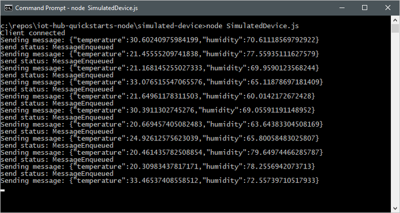

Download the sample Node.js project from https://github.com/Azure-Samples/azure-iot-samples-node/archive/master.zip and extract the ZIP archive.
# Quickstart: Send telemetry from a device to an IoT hub to Azure Database for PostgreSQL 


IoTHub is an Azure service that enables you to ingest high volumes of telemetry from your IoT devices into the cloud for storage or processing. PostgreSQL is an established open source database with strong native JSON capabilities, and the plv8 extension further enhances JSON processing capabilities by integrating the JavaScript v8 engine with SQL. Azure Database for PostgreSQL with plv8 extension can be leveraged as persistent layer for IoT telemetry stream for storage, processing and reporting. 
In this QuickStart, you send telemetry from a simulated device application, through IoT Hub, to Azure Database for PostgreSQL where you store, process and analyze the telemetry information. 
The QuickStart uses Node.js applications to send telemetry to IoTHub. Before you run the application, you create an IoT hub and register a device with the hub.

[!INCLUDE [cloud-shell-try-it.md](../../includes/cloud-shell-try-it.md)]

If you don’t have an Azure subscription, create a [free account](https://azure.microsoft.com/free/?WT.mc_id=A261C142F) before you begin.

## Prerequisites
The sample application to simulate device telemetry is written using Node.js. You need Node.js v4.x.x or later on your development machine. You can download Node.js for multiple platforms from [nodejs.org](https://nodejs.org).

You can verify the current version of Node.js on your development machine using the following command:

```cmd/sh
node --version
```
Download the sample Node.js project from https://github.com/Azure-Samples/azure-iot-samples-node/archive/master.zip and extract the ZIP archive.

## Create an IoT hub
Use the [Azure Portal to create IoT Hub](https://docs.microsoft.com/en-us/azure/iot-hub/iot-hub-create-through-portal).

## Register a device
A device must be registered with your IoT hub before it can connect. In this QuickStart, you use the [Azure CLI](https://docs.microsoft.com/en-us/cli/azure/install-azure-cli?view=azure-cli-latest) or [Azure Cloud shell](https://azure.microsoft.com/en-us/features/cloud-shell/) to register a simulated device.

1.	 Run the following commands in Azure Cloud Shell to add the IoT Hub CLI extension and to create the device identity. 

**YourIoTHubName**: Replace this placeholder below with the name you choose for your IoT hub.

**MyNodeDevice**: This is the name given for the registered device. Use MyNodeDevice as shown. If you choose a different name for your device, you will also need to use that name throughout this article and update the device name in the sample applications before you run them.

```cmd/sh
az extension add --name azure-cli-iot-ext
az iot hub device-identity create --hub-name YourIoTHubName --device-id MyNodeDevice
```

2.	Run the following commands in Azure Cloud Shell to get the _device connection string_ for the device you just registered:

**YourIoTHubName**: Replace this placeholder below with the name you choose for your IoT hub.

```cmd/sh
az iot hub device-identity show-connection-string --hub-name YourIoTHubName --device-id MyNodeDevice --output table
```

Make a note of the **device connection string**, which looks like:

**HostName={YourIoTHubName}.azuredevices.net;DeviceId=MyNodeDevice;SharedAccessKey={YourSharedAccessKey}**

You use this value later in the quickstart.

3.	You also need a _service connection string_ to enable the back-end application to connect to your IoT hub in order to retrieve the messages. The following command retrieves the service connection string for your IoT hub:

**YourIoTHubName**: Replace this placeholder below with the name you choose for your IoT hub.

```cmd/sh
az iot hub show-connection-string --hub-name YourIoTHubName --output table
```

Make a note of the **service connection string**, which looks like:

**HostName={YourIoTHubName}.azure-devices.net;SharedAccessKeyName=iothubowner;SharedAccessKey={YourSharedAccessKey}`**

You use this value later in the QuickStart. The service connection string is different from the device connection string.

## Send simulated telemetry

The simulated device application connects to a device-specific endpoint on your IoT hub and sends simulated temperature and humidity telemetry.

1. Open your local terminal window, navigate to the root folder of the sample Node.js project. Then navigate to the **simulated-device** folder.

1. Open the **SimulatedDevice.js** file in a text editor of your choice.

Replace the value of the `connectionString` variable with the device connection string you made a note of previously. Then save your changes to **SimulatedDevice.js** file.

2. In the local terminal window, run the following commands to install the required libraries and run the simulated device application:

    ```cmd/sh
    npm install
    node SimulatedDevice.js
    ```

   The following screenshot shows the output as the simulated device application sends telemetry to your IoT hub:

    

