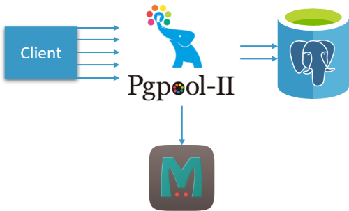
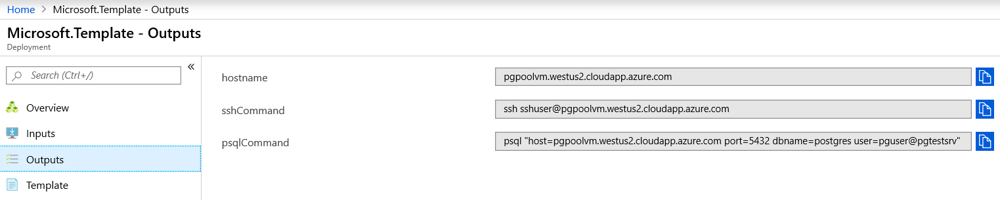

# Configure Connection Pooling and Query Caching with Pgpool for Azure DB for PostgreSQL

<a href="https://portal.azure.com/#create/Microsoft.Template/uri/https%3A%2F%2Fraw.githubusercontent.com%2FAzure%2Fazure-postgresql%2Fmaster%2Farm-templates%2FExampleWithPgpoolQueryCache%2Fazuredeploy.json" target="_blank">
    
</a>
<a href="http://armviz.io/#/?load=https%3A%2F%2Fraw.githubusercontent.com%2FAzure%2Fazure-postgresql%2Fmaster%2Farm-templates%2FExampleWithPgpoolQueryCache%2Fazuredeploy.json" target="_blank">
    
</a>

This ARM template deploys [Azure Database for PostgreSQL Server](https://docs.microsoft.com/en-us/azure/postgresql/overview) and [Ubuntu VM](http://releases.ubuntu.com/19.04/). Ubuntu VM is configured with [Pgpool](https://www.pgpool.net/) and [Memcached](https://memcached.org/) to provide [connection pooling](https://en.wikipedia.org/wiki/Connection_pool) and [query caching](http://www.pgpool.net/docs/latest/en/html/runtime-in-memory-query-cache.html) with the deployed Azure Database for PostgreSQL Server. 

## Benefits of Connection Pooling and Query Caching

In PostgreSQL, establishing a connection is an expensive operation. Applications frequently opening and closing connections at the end of transactions can experience performance degradation. Connection pooling can reduce connection latency by reusing existing connections. 

If multiple clients independently send queries, the database engine may receive the same query multiple times from different clients. If query results are cached and subsequent executions of identical queries can be served from the cache, database resources are saved. Also, query results coming from the cache can be provided with low latency by avoiding the round-trip to the PostgreSQL server altogether.


## Introduction to Pgpool and Memcached

[Pgpool](https://www.pgpool.net/) is a middleware sitting between database clients and the PostgreSQL server. It provides connection pooling, query caching, and a number of further features. 

[Memcached](https://memcached.org/) is a high-performance in-memory caching system, able to handle arbitrary data.

Pgpool can be configured to perform connection pooling and query caching with Memcached as the backing query result cache.




### Note
For a pure connection pooling solution that does not require Pgpool's unique features like query caching, [ARM template based on PgBouncer](https://github.com/Azure/azure-postgresql/tree/master/arm-templates/ExampleWithPgBouncer) is an alternative option to consider.

## Deployment and Connectivity

Click on the **Deploy to Azure** button above to deploy the ARM Template **azuredeploy.json**

Once you have deployed the ARM Template **successfully without any errors**, you will be able to see the hostname, sshCommand and psqlCommand as part of Deployment Outputs





**hostname** is the Public DNS for the Ubuntu VM hosting Pgpool and Memcached

**sshCommand** provides the ssh command to connect to the Ubuntu VM hosting Pgpool and Memcached

**psqlCommand** provides the psql command to connect the PostgreSQL Server 


```
psql "host={dnsLabelPrefix}.{region}.cloudapp.azure.com port=5432 dbname={your_database} user={your_username}"
```

Example : 

```
psql "host=pgpoolvm.westus.cloudapp.azure.com port=5432 dbname=postgres user=pguser@pgtestserver"
```

To adjust Pgpool configuration to your needs after deployment, modify settings in **/etc/pgpool2/pgpool.conf**. Some settings require a restart of Pgpool to become effective: **service pgpool2 restart**.

Memcached config file is **/etc/memcached.conf**, a service restart can be triggered by executing **service memcached restart**.

## Contribution 


If you have trouble deploying the ARM Template, please let us know by opening an issue: https://github.com/Azure/azure-postgresql/issues

Feel free to contribute any updates or bug fixes by creating a pull request: https://github.com/Azure/azure-postgresql/pulls

Thank you!


## References

[Performance best practices for using Azure Database for PostgreSQL – Connection Pooling](https://azure.microsoft.com/en-us/blog/performance-best-practices-for-using-azure-database-for-postgresql-connection-pooling/)

[Improve Performance of Read Intensive Workloads on Azure DB for PostgreSQL using Query Caching ](https://techcommunity.microsoft.com/t5/Azure-Database-for-PostgreSQL/Improve-Performance-of-Read-Intensive-Workloads-on-Azure-DB-for/ba-p/743860)