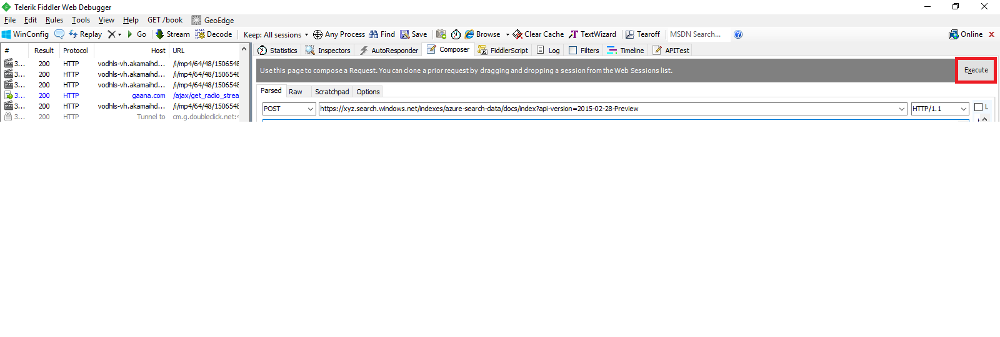

Prerequisites
=============

-   [Telerik Fiddler](https://www.telerik.com/download/fiddler)

Push coffee shops data into an index
========================

Steps to push data into an index

1. Download and install Telerik Fiddler with the default setting from given link in their prerequisites.

1. Open Telerik Fiddler.
1. Click on the Composer tab.
 

1. Select Post Request from dropdown. 
  
1. Paste the Service URl given below and replace [service name] with your service name.
`https://[service name].search.windows.net/indexes/azure-search-data/docs/index?api-version=2015-02-28-Preview`

   Example for xyz service name : `https://xyz.search.windows.net/indexes/azure-search-data/docs/index?api-version=2015-02-28-Preview`
   

6. Add content type and Add API key by replacing [admin key].

Steps to get API key
- Login to the Microsoft Azure portal <a href="https://portal.azure.com">Login</a>.
- Click on All Resources from left menu panel.
- Click on resource of type Search Service from list.
- Click on Key from the Setting section.
- On Right panel you will get Primary Admin key.
- 
7. Paste the coffee shops geo-spatial data in request body in the given format.

8. In the request body, add the value to location id of the coffee shops `1, 2,..etc`, name of the coffee shop, address of the coffee shop, city of the coffee shop, country of the coffee shop and longitude, latitude in the location field.

9. Click on the Execute button, by this process the request body data will insert into `azure-search-data` index.

