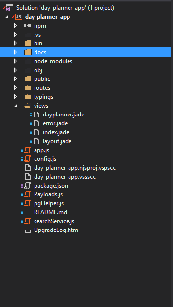
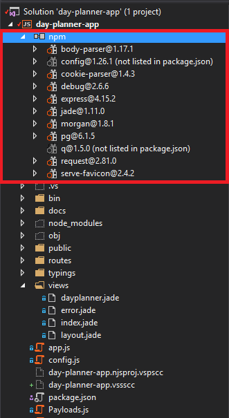
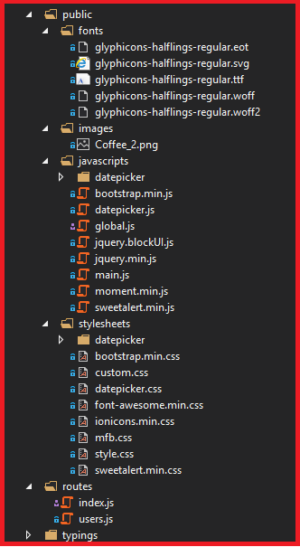
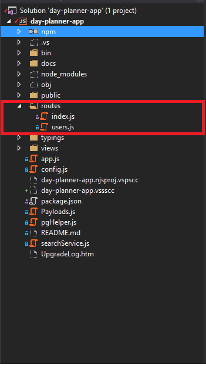
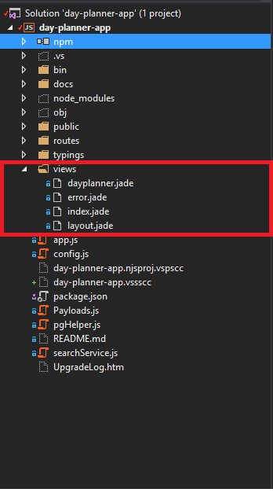
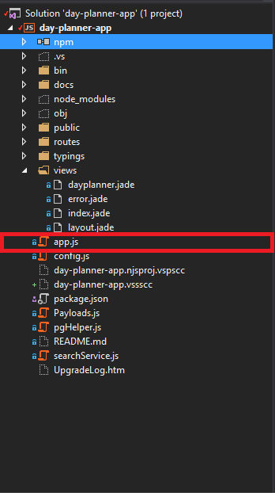
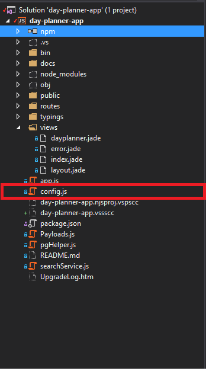
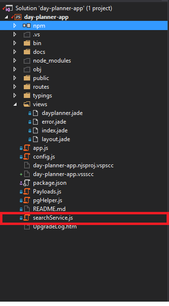

# Day Planner App (App Directory Structure)

The Day Planner App is a Node.js application made using Express which is a minimal and flexible Node.js web application framework  

Following steps provide the information about code structure: - 
1.	Clone the git repository of <a href="#">Day Planner App</a>.

1.	For setting up the project, open Visual Studio and add the <a href="https://www.visualstudio.com/vs/node-js/">Node JS extension</a> into it.

1.	Open the downloaded source code into Visual Studio.

1.	Now you can view the directory structure of the Day Planner App in `Solution Explorer` window.

    

1.	`npm` directory contains all the packages which we require to run the application.

    

1.	The `docs` directory contains all the mark down (.md) files. These docs are helpful in understanding the app, integrated Azure services and the deployment strategy for the app.

    

1.	The `public` directory contains the fonts, JavaScript files, images and css files which are exposed to client. 
    This directory contains some sub-directories, they are as follows:-  
    - __font__ :- Contains all glyphicons used in our app.
    - __JavaScript__ :- Contains all JavaScript files which make our app interactive.
    - __stylesheets__ :- Contains all css files.

    

1.	The `route` directory contains 'index.js' file which helps in routing where in routing refers to determining how an application responds to a client's request to a particular endpoint, which is a URI (or path) and a specific HTTP request method (GET, POST, and so on).

    

1.	The `views` directory contains all the application pages which are rendered to client based on request received. The template engine used here is jade which enables you to use static template files in your application. At runtime, the template engine replaces variables in a template file with actual values, and transforms the template into an JADE file sent to the client. This approach makes it easier to design an HTML page. 
    
    

1.	The `app.js` file, in the root directory, is the main and most important file for launching the node js application, this file defines and initialize all routes, views and much more.

    

1.	The `config.js` file contains configuration settings which includes **Azure Search Service API Key**, **Azure Search Service URL**, **Azure Search Service Index Name**, **Azure Search Service API Version** and **AzureDB for PostgreSQL Connection String**. 
    The values for many config file keys are being retrieved from the environment variables that has been set up using ARM template, in the deployed application environment on 'Azure App Service'. 
    If you require to make the changes in the Search API key, Search API Version and Postgres Connection string then this file will be helpful.

    

1.	The `package.json` defines the application's dependencies and the entry point of your application.

    

1.	The `Payloads.js` file contains the sample documents and index schema for 'Azure Search Service' that application uses when it is launched for the first time.

    

1.	The `pghelper.js` file acts as interface to perform actions on 'AzureDB for PostgreSQL'. This file also contains the schema and sample data creation methods which acts when the application is launched for first time.

    

1.	The `searchService.js` file acts as interface to perform actions on 'Azure Search Service'.

    

