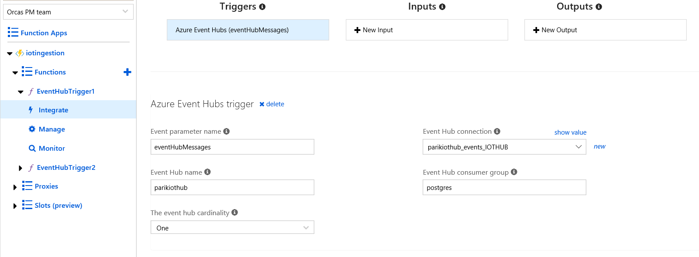
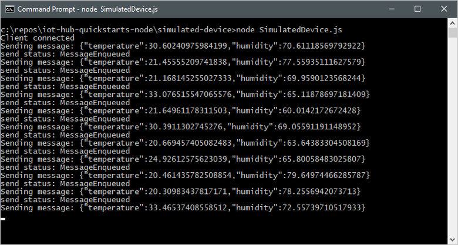

# Quickstart: Send telemetry from a device to an IoT hub to Azure Database for PostgreSQL 


Azure IoT Hub is an managed Azure service that enables you to ingest high volumes of telemetry from your IoT devices into the cloud for storage or processing. PostgreSQL is an established open source database with strong native JSON capabilities, and the plv8 extension further enhances JSON processing capabilities by integrating the JavaScript v8 engine with SQL. Azure Database for PostgreSQL with plv8 extension can be leveraged as persistent layer for IoT telemetry stream for storage, processing and analytics. 
In this QuickStart, you send telemetry from a simulated device application, through IoT Hub and Azure function, to Azure Database for PostgreSQL where you store, process and analyze the telemetry information. The QuickStart uses Node.js applications to send telemetry to IoTHub. Before you run the application, 

1. Create an IoT hub and register a device with the hub
2. Create a Azure Database for PostgreSQL server and a database iotdemo to store telemetry data stream.
3. Create a Azure function which EventHub binding trigger to extract the incoming message from the IoT data stream and store it in PostgreSQL database.

If you don’t have an Azure subscription, create a [free account](https://azure.microsoft.com/free/?WT.mc_id=A261C142F) before you begin.

## Prerequisites
The sample application to simulate device telemetry is written using Node.js. You need Node.js v4.x.x or later on your development machine. You can download Node.js for multiple platforms from [nodejs.org](https://nodejs.org).

You can verify the current version of Node.js on your development machine using the following command:

```cmd/sh
node --version
```
Download the sample Node.js project from https://github.com/Azure-Samples/azure-iot-samples-node/archive/master.zip and extract the ZIP archive.

## Create an IoT hub
Use the [Azure Portal to create IoT Hub](https://docs.microsoft.com/en-us/azure/iot-hub/iot-hub-create-through-portal).

## Register a device
A device must be registered with your IoT hub before it can connect. In this QuickStart, you use the [Azure CLI](https://docs.microsoft.com/en-us/cli/azure/install-azure-cli?view=azure-cli-latest) or [Azure Cloud shell](https://azure.microsoft.com/en-us/features/cloud-shell/) to register a simulated device.

1.	 Run the following commands in Azure Cloud Shell to add the IoT Hub CLI extension and to create the device identity. 
**YourIoTHubName**: Replace this placeholder below with the name you choose for your IoT hub.

**MyNodeDevice**: This is the name given for the registered device. Use MyNodeDevice as shown. If you choose a different name for your device, you will also need to use that name throughout this article and update the device name in the sample applications before you run them.

```cmd/sh
az extension add --name azure-cli-iot-ext
az iot hub device-identity create --hub-name YourIoTHubName --device-id MyNodeDevice
```

2.	Run the following commands in Azure Cloud Shell to get the _device connection string_ for the device you just registered:

**YourIoTHubName**: Replace this placeholder below with the name you choose for your IoT hub.

```cmd/sh
az iot hub device-identity show-connection-string --hub-name YourIoTHubName --device-id MyNodeDevice --output table
```

Make a note of the **device connection string**, which looks like:

**HostName={YourIoTHubName}.azuredevices.net;DeviceId=MyNodeDevice;SharedAccessKey={YourSharedAccessKey}**

You use this value later in the quickstart.

3.	You also need a _service connection string_ to enable the back-end application to connect to your IoT hub in order to retrieve the messages. The following command retrieves the service connection string for your IoT hub:

**YourIoTHubName**: Replace this placeholder below with the name you choose for your IoT hub.

```cmd/sh
az iot hub show-connection-string --hub-name YourIoTHubName --output table
```

Make a note of the **service connection string**, which looks like:

**HostName={YourIoTHubName}.azure-devices.net;SharedAccessKeyName=iothubowner;SharedAccessKey={YourSharedAccessKey}`**

You use this value later in the QuickStart. The service connection string is different from the device connection string.

## Create a Azure Database for PostgreSQL Server
Use [Azure portal](https://docs.microsoft.com/en-us/azure/postgresql/quickstart-create-server-database-portal) or the [Azure CLI](https://docs.microsoft.com/en-us/azure/postgresql/quickstart-create-server-database-azure-cli) to provision a new Azure Database for PostgreSQL server. 

## Create a PostgreSQL database in the server
After the server is provisioned, connect to the server using “pgadmin” or “psql” with the server admin user role and create a new database called iotdemo on the server and a table called iotdata to store the IoT telemetry data. The iotdata table contains a column called data with jsonc datatype to store the incoming IoT stream from IotHub in json format. In the database, we enable plv8 extension and create a sample plv8 function useful for querying to extract a temperature column from the json documents.

```cmd/sh
CREATE DATABASE iotdemo;
CREATE TABLE public.iotdata
(
    deviceid integer NOT NULL,
    createdate timestamp without time zone NOT NULL DEFAULT now(),
    data jsonb
);
CREATE INDEX iot_temp_index
    ON public.iotdata USING btree
    (((data ->> 'temperature'::text)::double precision));
CREATE EXTENSION plv8;
CREATE OR REPLACE FUNCTION public.get_temp(
	temperature text,
	data jsonb)
    RETURNS numeric
    LANGUAGE 'plv8'
    COST 100
    IMMUTABLE STRICT 
AS $BODY$
return data[temperature];
$BODY$;
```

## Create Azure Function 
Create an JavaScript Azure function with EventHub trigger bindings using [Azure Portal](https://docs.microsoft.com/en-us/azure/azure-functions/functions-bindings-event-hubs).
Once the Eventhub trigger function is created, click on Integrate tab on the blade and specify the `connectionString` with the **service connection string** to connect to the Iot Hub service.

 

Use the Javascript [index.js](https://github.com/savjani/azure-postgresql/blob/master/samples/IoT%20demo%20with%20Azure%20PostgreSQL/azure%20function/index.js) sample to create the function. The function is triggered for each incoming message stream in IoT Hub. It extracts the json message stream and inserts the data into PostgreSQL database iotdata created earlier hosted on Azure Database for PostgreSQL service.

## Running End-to-End demo to send IoT telemetry to Azure Database for PostgreSQL

## Send IoT telemetry
The simulated device application connects to a device-specific endpoint on your IoT hub and sends simulated temperature and humidity telemetry.

1. Open your local terminal window, navigate to the root folder of the sample Node.js project. Then navigate to the **simulated-device** folder.

2. Open the **SimulatedDevice.js** file in a text editor of your choice.
   Replace the value of the `connectionString` variable with the **device connection string** you made a note of previously. Then save your    changes to **SimulatedDevice.js** file.

3. In the local terminal window, run the following commands to install the required libraries and run the simulated device application:

    ```cmd/sh
    npm install
    node SimulatedDevice.js
    ```

   The following screenshot shows the output as the simulated device application sends telemetry to your IoT hub:

    


To simulate multiple devices, register multiple devices as shown earlier and save the **device connection string**, make multiple copies of SimultedDevice.js to SimultedDevice1.js, SimultedDevice2.js, SimultedDevice3.js and SimultedDevice4.js and update the SimulatedDevice*.js file with respective device connection string. Open new terminal window to run and simulate telemetry from each device.

# Analyze IoT data in Azure Database for PostgreSQL server

Once the device telemetry is emited and assuming the configuration of IoT hub, azure function and Azure Database for PostgreSQL is correct, the data would start flowing in the workflow and stored in iotdata table in PostgreSQL database. You can execute following queries from pgadmin or psql to analyze the IoT telemetry data.

```cmd/sh
SELECT deviceid, count(*) from iotdata
group by deviceid;

SELECT  * from iotdata
where get_temp('temperature',data)>30
limit 10;

SELECT 
deviceid, 
iotdata.data ->> 'humidity' as humidity
from iotdata
where deviceid = 1
```
