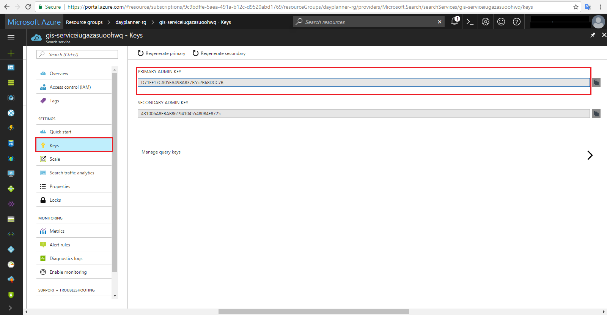
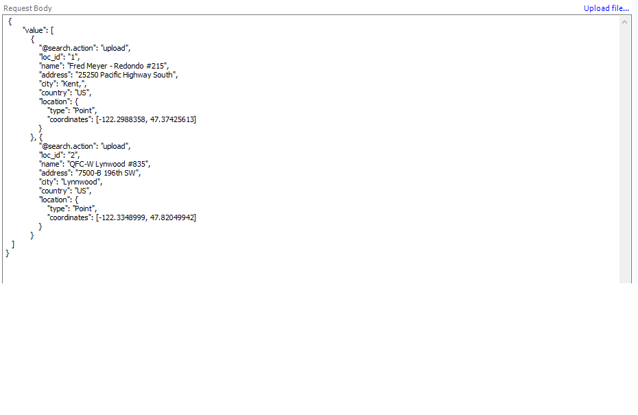

Prerequisites
=============

-   [Telerik Fiddler](https://www.telerik.com/download/fiddler)

Push coffee shops data into an index
========================

Steps to push data into an index:-

1. Download and install Telerik Fiddler with the default setting from given link in the prerequisites.

2. Open Telerik Fiddler.

3. Click on the __Composer__ tab.

  

4. Select `POST` Request from dropdown. 

  

5. Paste the Service URl given below and replace [service name] with your service name.
`https://[service name].search.windows.net/indexes/azure-search-data/docs/index?api-version=2015-02-28-Preview`

   __Example for xyz service name :-__ `https://xyz.search.windows.net/indexes/azure-search-data/docs/index?api-version=2015-02-28-Preview`

  

6. Add __Content Type__ and Add __API Key__ by replacing [admin key].

  

Steps to get API key
- Login to the Microsoft Azure portal <a href="https://portal.azure.com">Login</a>.
- Click on `Resources Groups` from left menu panel.
- Click on resource of `type` __Search Service__ from the resources list.

  

- Click on __Key__ from the `Setting section`.
- On Right panel you will get __Primary Admin key__.

  

7. Paste the coffee shops geo-spatial data in request body in the given format.
 
  

8. In the request body, add the value to __location_id__ of the coffee shops `1, 2,..etc`, __name__ of the coffee shop, __address__ of the coffee shop, __city__ of the coffee shop, __country__ of the coffee shop and __longitude, latitude__ in the location field.

9. Example for two coffee shops geo-spatial data object:-

  

10. Click on the `Execute Button`, by this process the request body data will insert into `azure-search-data` index.

  
