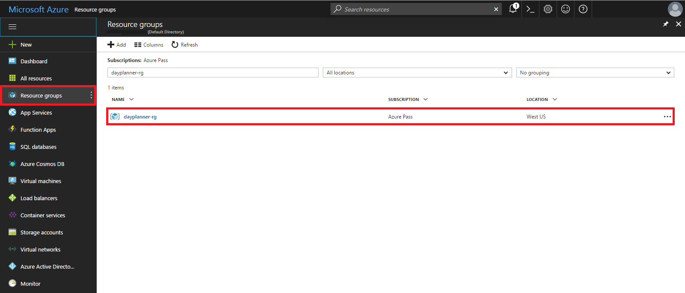
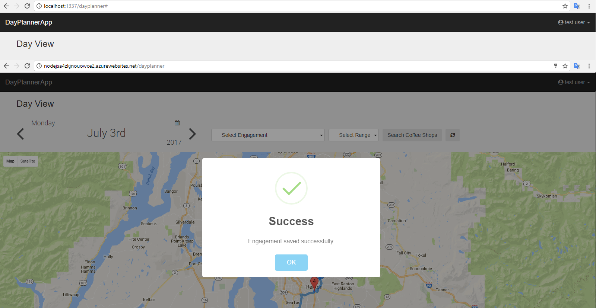
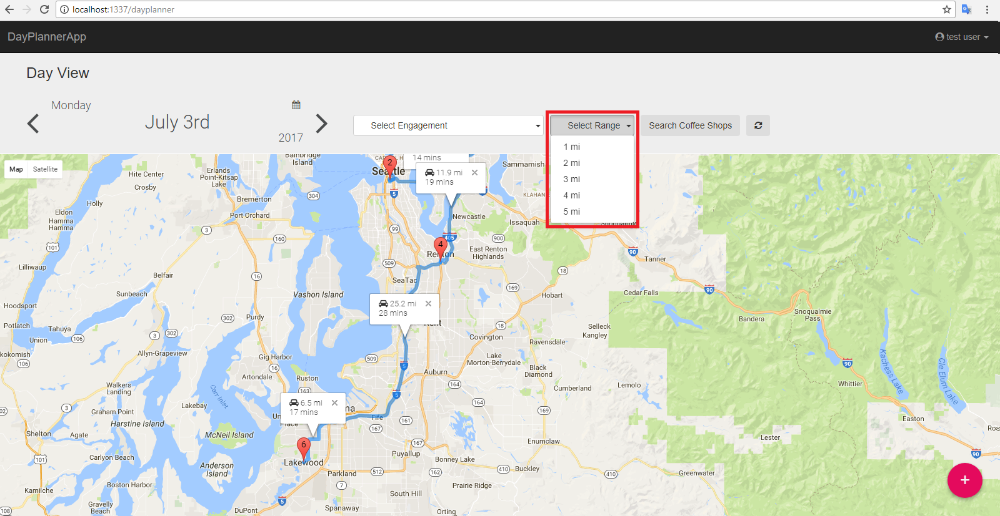
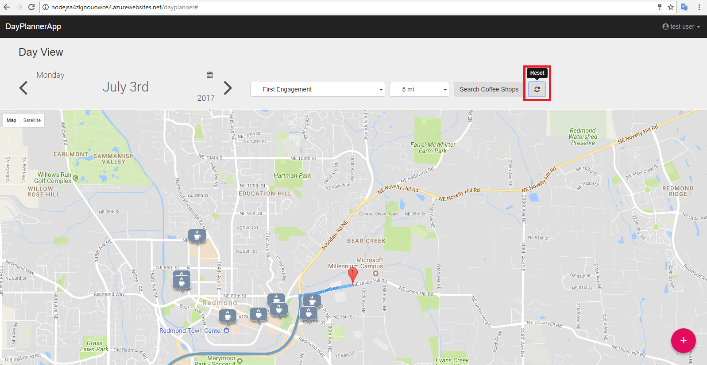
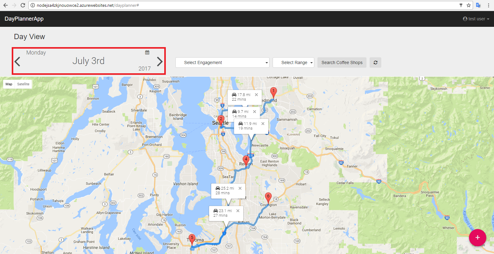

# Day Planner App (Azure App Service)  

To handle day-to-day engagements, the Day Planner App not only rely on Azure’s proven scalability and availability but also its breadth of features like __Azure App Service, AzureDB for PostgreSQL, & Azure Search Service__. User can add their engagements randomly with following parameters,

Parameter | Description
------------ | -------------
Name | Title of engagement
Location | Location of the Engagement
Meeting Date | Date of engagement 
Start Time | Start time of engagement
End Time | End time of engagement

All the Engagement are stored in __AzureDB for PostgreSQL__ . It is a powerful, open source object-relational database system which has `GeoSpatial` capabilities `PostGIS` functionality 
and it is managed service by Azure by the `Azure Database for PostgreSQL Service` name. The data is plotted on the map according to Engagement Date and Ascending order of the Start Time. 

Following are the steps to visit the hosted website with all this features:-

1.	Go to your Microsoft Azure subscription. 

1.	Click on `Resource groups`.

1.	Search for the resource group that you created using ARM Template.

    

1.	Click on the resource group to view all the resources that were deployed using `ARM Template`.
    - Azure App Service.
    - Azure Database for PostgreSQL Service
    - Azure Search Service
    - Azure App Service plan
    - ….

    

1.	Click on the second website, the one that has the `App Service` key in its __Type__.

    

1.	The overview of `App Service` will open up, on the left side panel the __Console__ is present. 
  
    The __Azure portal__ provides console access to your app. You can explore your app's file system and run powershell/cmd scripts. You are bound by the same permissions set as your running app code when executing __Console Commands__. Access to protected directories or running scripts that require elevated permissions is blocked. 
    
    This __Console__ will also show all environment variable used in the __Day Planner App__ and much more. 

    To view the environment variable in the app goes through the following steps:-
    - Enter __`printenv`__ command on the console and press <kbd>Enter</kbd> key.

    

1.	The `printenv` command displays all the variable used by the hosted `App Service`. 
    As of now we are using two main services of **Azure** and they are,
    - AzureDB for PostgreSQL managed service
    - Azure Search Service

    For accessing __PostgreSQL__ database, we required the connection string and this connection string we retrieve from `environment variable`.

    And for accessing __Azure Search Service__ we required the `SearchServicePrimaryKey` and `SearchServiceUri` we retrieve it from the `environment variable`.

    __Note__: The required environment variables by the `Day Planner App` are being exported using ARM template while deploying resources. See <a href="ARMTemplate.md">ARM Template doc</a> for more details.
    

1.	Click on the __Overview__ present on left side panel, it will open `App Service` overview. It contains the `URL` where our application is hosted.

    

1.	Once you click on the `URL`, the application will launch and it will take some time for first time launch. The reason behind this is, that it will create the table schema with sample data in the `AzureDB for PostgreSQL` for current date and create user in `userinfo` table. It will also create index and sample documents in that index with `Azure Search Service`. 

     

1.	At the First launch the login page will open. You can login with already created sample user with **Username** as `test` and **Password** as `test@123`. It will populate sample engagements data for the user on Day View page of the app.
    
    
   
1.	You can click on Register tab to register with new user as well. After registering successfully, you can login with new credentials.
   
    

1.	Once you login with demo/default user, Day Planner App page will open and as you click on the any marker it will display the details of that location which includes `Engagement Title`, `Start Time` of Engagement, `End Time` of Engagement and the `Location` of the Engagement.

    

1.	Click on the `Add` button, we can add the new engagement from the website.

    

1.	Click on 'Add New Engagement' icon at the bottom right corner of the page and it will open a model dialog to add new engagement. Enter the data for current date as shown in the screen below. 

    

1.	After the saving the engagement successfully, it gets stored in __PostgreSQL__ db and it will show a success message on the screen.

    

1.	The engagement which we added last time is automatically reflected on the map.

    

1.	Now, the web application also provides the functionality to search near-by coffee shops to engagements using __Azure Search Service__, for that we have the controls on the Web Site as marked.

    

1.	First, select the `Engagement` for which you want to search the nearby coffee shops.

    

1.	After that select the range (radius to search in with respect to the engagement).

    

1.	Finally, click on the `Search Coffee Shops` button to run geospatial query using __Azure Search Service__. 

    

1.	Depending on the selection i.e. selected `Engagement`, selected `Miles` the `Azure Search Service` will get coffee shops falling in the selected range of that engagement.

    

1.	Click on the `Reset` button for re-initializing the `Azure Search Controls` on the website.

    

1.	For toggle between the dates, the `left arrow` and `right arrow` will help us.

    

1.	Click on the Username, it will show the link for profile page and logout.

    
1.	Click on Profile page to view user profile and to change password.
    
    

1.	To change password, enter current password, new password and confirm password then click on Change password button.
    
    

1.	It will validate entered currend password, if it is valid then you will get a success message and you need to login again.

    

__Default/Demo User__: Username: `test`, Password: `test@123`

__Note__: The Sample Coffee Shops data, pushed by application's first launch to `Azure Search Service`, is in context with the sample engagements data pushed to `AzureDB for PostgreSQL`. As the application provides an interface only to add new engagement data to Azure Postgres Service, the following doc will help you to add more documents to Azure Search Service manually. Please refer <a href="AddingDocumentsToAzureSearchIndex.md">Adding Documents To Azure Search Index.</a>   
