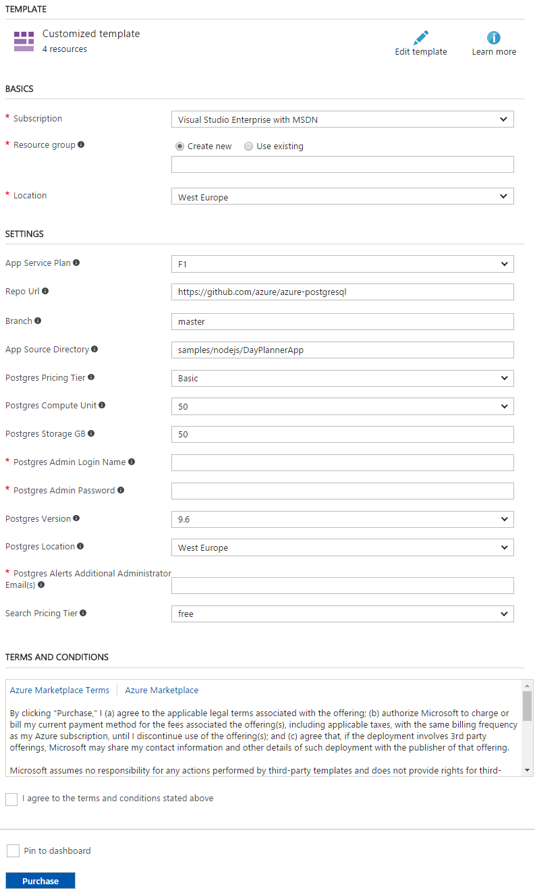

## Deployment Instructions

Perform following steps to Deploy Node.js web application in Azure and connect it to AzureDB for PostgreSQL Database Service and Azure Search Service.

1. Click on __Deploy to Azure__ button above. You will be redirected to custom deployment window of Azure Portal.
2. On __Custom deployment__ page, select __Subscription__ type.
3. Create new or use existing __Resource Group__. An Azure resource group is a logical container into which Azure resources like web apps, databases and storage accounts are deployed and managed. [Learn more here.](https://docs.microsoft.com/en-us/azure/azure-resource-manager/resource-group-portal)
4. Select __Location__ from the available locations for resource group.
5. Select __App Service Plan__. It is pricing model for hosting application, default value is set to __F1__ which represent free service.
6. The __Repo Url__ is the GitHub repository url of web application. The default value is set to the current GitHub repository Url which contains sample Node.js application source code which connects with AzureDB for PostgreSQL Service and Azure Search service created with the ARM template. Leave it as is for this demo
7. This __Branch__ is branch name of GitHub repository where application resides, leave it as is for this demo.
8. __App Source Directory__ is application source code directory in the GitHub repository to deploy on Azure App Service.

    

8. Select the __Postgres Pricing Tier__ or leave it as is.
9. Provide the __Postgres Compute Unit__ or leave it as is. [Learn more about Compute Unit](https://docs.microsoft.com/en-us/azure/postgresql/concepts-compute-unit-and-storage#what-are-compute-units)
9. The __Postgres Storage GB__ is the size of physical memory (in GB) for PostgreSQL Database Server. [Learn more about Storage Unit](https://docs.microsoft.com/en-us/azure/postgresql/concepts-compute-unit-and-storage#what-are-storage-units)
10. __Postgres Admin Login Name__ is username for PostgreSQL Database Server.
11. __Postgres Admin Password__ is password for PostgreSQL Database Server. It must contain character from three of the following categories – English uppercase letters, English lowercase letters, number (0-9), and non-alphanumeric characters (!, $, #, %).
12. Select __Postgres Version__ for PostgreSQL Database Server.
13. Select __Postgres Location__ from available locations for PostgreSQL Database Server.
15. __Postgres Alerts Additional Administrator Email(s)__ are email addresses used for CPU and Storage usage alerts for Postgres service.
15. Select __Search Service Sku__ from available plans.
14. Mark Check __I agree to the terms and conditions stated above__ checkbox. 
15. Click on __Purchase__ button.

It will take few minutes to deploy the Nodejs application, AzureDB for PostgreSQL Service and Azure Search Service. After successful deployment, you can browse the Day Planner App.
