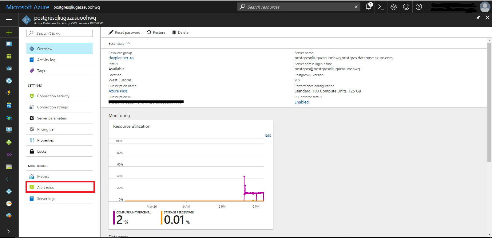
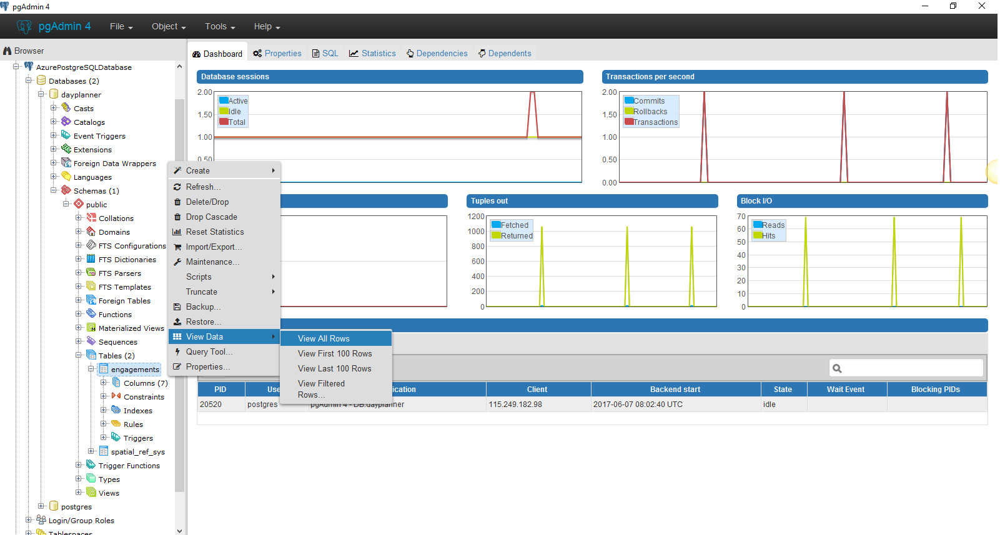

# Test PostgreSQL Connection

1. Go to <a href="https://portal.azure.com">Azure Portal</a>.	

1. Search for the resource group that you created using ARM Template.

    

1.	Click on the AzureDB for PostgreSQL managed service, and then you can view the over view of __PostgreSQL__ Database. 

    

1.	Click on the `Alert Rules` present on left side panel. 

    

1.	There are two `Alert Rules` created while deploying with ARM Template.
      - __CPU-Alert:-__ This is a CPU usage based alert with a threshold of 80% over an evaluation window of 5 minutes. If the condition is violated the alert will transition to an “Active” state and when the alert condition is resolved the alert rules gets back to `Non-Activated or Warning` states.  Each data point for CPU percentage is an average value over the last five-minute period. In the backend, the alerting engine evaluates each data point and triggers a state change event when a condition is violated or resolved.
       
      - __Storage-Alert: -__ This is a Storage based alert over an evaluation window of 5 minutes and if the Storage goes above 80%, the alert triggers.

    

1.	Click on the `Connection String` present on left side panel.
    

1.	After clicking on it on the right-side panel different __connection strings__ are visible.  As we know, every language has its own syntax, so azure provides the correct syntax for connecting the __PostgreSQL__ database with related languages.<br/>
    As we deploy our app with __NodeJS__ language, and the correct format of the connection string is given on the right-side panel. We are using this format to connect our NodeJs app with PostgreSQL database.<br/>
    __Basic Syntax:-__

      > postgres://[username]:[password]@[host]:[port]/[database]?ssl=true <br/>

    Above is the basic syntax of `Connection String`. 

    

1. Download <a href="https://www.pgadmin.org/download/">pgAdmin-4</a> for connecting the Server database on your local machine for testing the database connection.

1. Open the pgAdmin-4 and click on `Add New Server` to add New Server into it.

    

1.  Now, to connect the Server Database on local environment add information on pop up model. 
    ```
    Name:- AzurePostgreSQLDatabase 
    ```
    

1.  After that add some more information on pop up model. 
    ```
    HostName:- postgresqliugazasuoohwq.postgres.database.azure.com 
    Username:- postgres@postgresqliugazasuoohwq 
    Password:- pg@12345  
    ```
    

1. After successful connection, the `AzurePostgreSQLDatabase` server will be visible on pgAdmin-4.

    

1.	The Server will contain `dayplanner` database at first which gets created during deployment. The first time that you run the Day Planner app then `userinfo` table with test user and `engagements` tables with sample data with current date will be created. 
    
    

1.	The schema of `userinfo` table is as follows.
    
    Column Name | Data Type | Description
    ------------ | ------------- | -------------
    uid | serial | Unique id of users with auto-increment feature
    firstname | character varying(255) | First Name of the user 
    lastname | character varying(255) | Last Name of the user
    username | character varying(255) | UserName of the user with unique feature
    password | character varying(255) | Password of the user
    
1.	The schema of `engagements` table is as follows.
    
    Column Name | Data Type | Description
    ------------ | ------------- | -------------
    loc_id | serial | Unique id of engagement with auto-increment feature
    loc_name | character varying(255) | Location address of engagement 
    title | character varying(255) | Subject of engagement
    date | date | Date of engagement
    start_time | time without time zone | Start time of engagement
    end_time | time without time zone | End time of engagement
    location | geography(Point) | latitude and longitude of engagement with PostGIS features

1.	To view all records in the `userinfo` table follow the following steps:-
      -  Right click on `userinfo` table.
      -  After that, click on the `View Data`.
      -  Now click on `View All Rows`.
    
    
    

1.	Now you can see all records present on the `userinfo` table.

    
    

1.	To view all records in the `engagements` table follow the following steps:-
      -  Right click on `engagements` table.
      -  After that, click on the `View Data`.
      -  Now click on `View All Rows`.

    

1.	Now you can see all records present on the `engagements` table.

    

1.	To perform the crud operation like `select`, `insert`, `update`, `delete` and so on.... on the `engagements` table, all we need is __Query Tool__.<br/>
    To open __Query Tool__ click on the __Tools__ present at the top of `pgAdmin-4` and then click on __Query Tool__.

    

1.	Write the actual query in the __Query Tools__ box and press the run button(highlighted in the image) to run the written query.
    
    

1.	The result of the query is shown below the __Query Tool__ box. 
    

    __Basic Query :-__
    ```sql
    SELECT array_to_json(array_agg(row_to_json(t))) as meeting_data 
    FROM (SELECT loc_id, loc_name, title, date, to_char(start_time::time, 'HH12:MI AM') as start, to_char(end_time::time, 'HH12:MI AM') as end, ST_AsGeoJSON(location)::json As geometry 
    FROM engagements As engmt 
    JOIN (SELECT uid, username 
    FROM userinfo) As usrinfo 
    ON engmt.uid = usrinfo.uid 
    where engmt.date = '<date_of_engagement>' and engmt.uid = '<user_id>') 
    As t;
    ```

    


