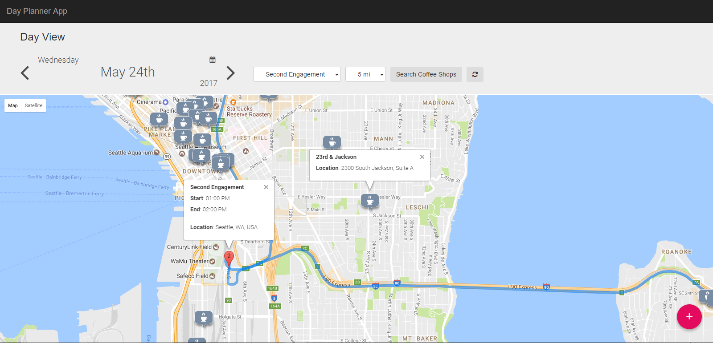

# Day Planner App

## Introduction
Get hands-on and learn how to build and deploy Ruby on Rails application as `Azure App Service` with `AzureDB for PostgreSQL` Database Service and `Azure Search Service` using ARM template as deployment strategy.

## App Overview

Day Planner App is a sample Ruby on Rails application that can be used to manage your day-to-day engagements. The app marks engagements, displays routes between them and showcases the distance and time required to reach the next engagement. 
The engagements are stored and retrieved from the __AzureDB for PostgreSQL__ database service using its geospatial capabilities. Depending on the date and start time of the engagement all engagements get arranged. 
The app also helps to search the near-by coffee shops to engagements by selecting the range as distance, using __Azure Search Service__ and its geospatial queries. 

## Pre-requisites
If you don't have an Azure subscription, create a [free account](https://azure.microsoft.com/en-us/free/?WT.mc_id=A261C142F) before you begin.

## Deployment

Follow the <a href="docs/DeploymentInstructions.md">deployment instructions</a> to get you started.

## Application Help Docs

1. <a href="docs/DayPlannerApp.md">Day Planner App (App Service)</a>

1. <a href="docs/TestPostgreSQLConnection.md">Test PostgreSQL Connections</a>

1. <a href="docs/AzureSearchService.md">Azure Search Service</a>

1. <a href="docs/ARMTemplate.md">ARM Template Details</a>

1. <a href="docs/AppDirectoryStructure.md">App Directory Structure</a>

## Clean up

To clean up the Azure assets:

1. Login to the Azure portal.
2. Delete the resource group created as part of the deployment. Internally this will delete all the child resources created in it.

## Contributing

This project has adopted the [Microsoft Open Source Code of Conduct](https://opensource.microsoft.com/codeofconduct/). For more information see the [Code of Conduct FAQ](https://opensource.microsoft.com/codeofconduct/faq/) or contact [opencode@microsoft.com](mailto:opencode@microsoft.com) with any additional questions or comments.

