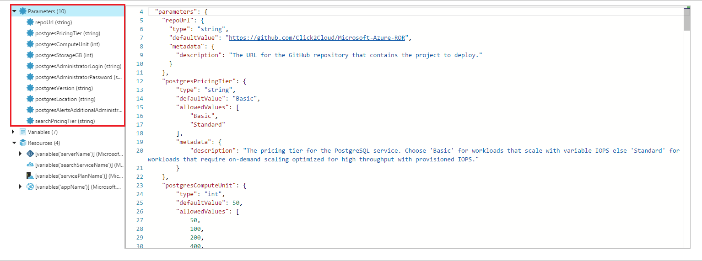

# ARM Template Structure


The infrastructure for your application is typically made up of many components – maybe a virtual machine, storage account, and virtual network, or a web app, database, database server, and 3rd party services. You do not see these components as separate entities, instead you see them as related and interdependent parts of a single entity. You want to deploy, manage, and monitor them as a group. Azure Resource Manager enables you to work with the resources in your solution as a group. You can deploy, update, or delete all the resources for your solution in a single, coordinated operation. You use a template for deployment and that template can work for different environments such as testing, staging, and production. Resource Manager provides security, auditing, and tagging features to help you manage your resources after deployment.

Following steps provide the information about the ARM Template being used for deployment:-
 
1.	The `deploy/azuredeploy.json` which is the ARM Template is a json file.

1.  There are 4 important blocks of ARM Template and they are __Parameters__, __Variables__, __Resources__ and __Output__.

1.  __Parameters :-__ Take a look at the parameters section to see that most of these parameters are what the Deploy to Azure button prompts you to input. The site behind the Deploy to Azure button populates the input UI using the parameters defined in azuredeploy.json. These parameters are used throughout the resource definitions, such as resource names, property values, etc..

    
 
1.  __Resources :-__ The resources node, you can see that 4 top-level resources are defined, including a PostgreSQL Server with firewall and alert rules, Hosting panel, a Web App and Auto scale setting.<br/>

    * Firstly the ARM Template start deploying __PostgreSQL database server__ with firewall rules, CPU-Percentage alert and Storage-alert. 
    
      Following code block show the way of deploying the `AzureDB for PostgreSQL` service and dependent components.

        ```json
        "resources": [
        {
            "apiVersion": "2016-02-01-privatepreview",
            "name": "[variables('serverName')]",
            "type": "Microsoft.DBforPostgreSQL/servers",
            "sku": {
                "name": "[variables('skuNamePG')]",
                "tier": "[parameters('postgresPricingTier')]",
                "capacity": "[parameters('postgresComputeUnit')]",
                "size": "[mul(parameters('postgresStorageGB'), 1024)]"
            },
            "location": "[parameters('postgresLocation')]",
            "properties": {
                "version": "[parameters('postgresVersion')]",
                "administratorLogin": "[parameters('postgresAdministratorLogin')]",
                "administratorLoginPassword": "[parameters('postgresAdministratorPassword')]",
                "storageMB": "[mul(parameters('postgresStorageGB'), 1024)]"
            },
            "resources": [
                {
                    "apiVersion": "2017-04-30-preview",
                    "name": "[variables('databaseName')]",
                    "type": "databases",
                    "location": "[parameters('postgresLocation')]",
                    "tags": {
                        "displayName": "PSQLDatabase"
                    },
                    "dependsOn": [
                        "[resourceId('Microsoft.DBforPostgreSQL/servers', variables('serverName'))]"
                    ],
                    "properties": {}
                },
                {
                    "apiVersion": "2017-04-30-preview",
                    "name": "PSQLServerFirewallRule",
                    "type": "firewallrules",
                    "location": "[parameters('postgresLocation')]",
                    "dependsOn": [
                        "[resourceId('Microsoft.DBforPostgreSQL/servers', variables('serverName'))]"
                    ],
                    "properties": {
                        "endIpAddress": "255.255.255.255",
                        "startIpAddress": "0.0.0.0"
                    }
                },
                {
                    "type": "Microsoft.Insights/alertRules",
                    "name": "CPU-Alert",
                    "apiVersion": "2016-03-01",
                    "location": "[resourceGroup().location]",
                    "dependsOn": [
                        "[resourceId('Microsoft.DBforPostgreSQL/servers', variables('serverName'))]"
                    ],
                    "properties": {
                        "name": "CPU-Alert",
                        "description": "Default alert which notify when cpu percent is greater than 80%",
                        "isEnabled": "true",
                        "condition": {
                            "odata.type": "Microsoft.Azure.Management.Insights.Models.ThresholdRuleCondition",
                            "dataSource": {
                                "odata.type": "Microsoft.Azure.Management.Insights.Models.RuleMetricDataSource",
                                "resourceUri": "[resourceId('Microsoft.DBforPostgreSQL/servers', variables('serverName'))]",
                                "metricName": "cpu_percent"
                            },
                            "operator": "GreaterThan",
                            "threshold": "80",
                            "windowSize": "00:05:00",
                            "timeAggregation": "Average"
                        },
                        "actions": [
                            {
                                "odata.type": "Microsoft.Azure.Management.Insights.Models.RuleEmailAction",
                                "sendToServiceOwners": "true",
                                "customEmails": "[variables('customEmails')]"
                            }
                        ]
                    }
                },
                {
                    "type": "Microsoft.Insights/alertRules",
                    "name": "Storage-Alert",
                    "apiVersion": "2016-03-01",
                    "location": "[resourceGroup().location]",
                    "dependsOn": [
                        "[resourceId('Microsoft.DBforPostgreSQL/servers', variables('serverName'))]"
                    ],
                    "properties": {
                        "name": "Storate_Alert",
                        "description": "Default alert which notify when storage percent is greater than 80%",
                        "isEnabled": "true",
                        "condition": {
                            "odata.type": "Microsoft.Azure.Management.Insights.Models.ThresholdRuleCondition",
                            "dataSource": {
                                "odata.type": "Microsoft.Azure.Management.Insights.Models.RuleMetricDataSource",
                                "resourceUri": "[resourceId('Microsoft.DBforPostgreSQL/servers', variables('serverName'))]",
                                "metricName": "storage_percent"
                            },
                            "operator": "GreaterThan",
                            "threshold": "80",
                            "windowSize": "00:05:00",
                            "timeAggregation": "Average"
                        },
                        "actions": [
                            {
                                "odata.type": "Microsoft.Azure.Management.Insights.Models.RuleEmailAction",
                                "sendToServiceOwners": "true",
                                "customEmails": "[variables('customEmails')]"
                            }
                        ]
                    }
                }
            ]
          }
        ]
        ``` 
        Note the important points about the above code block:-
        * The use of parameters ensures that the created resources are named and configured in a way that makes them consistent with one another.
        * The PostgreSQL have 3 nested `"resources":[....]`, each of these have different value of __type.__
        * The PostgreSQL database server deploy with the nested `resources`, where the database, the firewall rules and alert rules are defined, have a `dependsOn` element that specifies the resource ID of the root-level PostgreSQLServer resource. This tells Azure Resource Manager, “before you create this resource, that other resource must already exist; and if that other resource is defined in the template, then create that one first”.

 
    * After that the ARM Template starts deploying __Azure Search Service__.
      
      Following code block show the way of deploying __Azure Search Service__  

      ```json
        {
            "apiVersion": "2015-08-19",
            "name": "[variables('searchServiceName')]",
            "type": "Microsoft.Search/searchServices",
            "location": "[resourceGroup().location]",
            "sku": 
            {
            "name": "[toLower(parameters('searchPricingTier'))]"
            }
        }
      ```

    * After that the ARM Template starts deploying __App Service Plan__.
      
      Following code block show the way of deploying __App Service Plan__  

      ```json
      {
            "type": "Microsoft.Web/serverfarms",
            "name": "[variables('servicePlanName')]",
            "apiVersion": "2016-03-01",
            "location": "[resourceGroup().location]",
            "sku": 
            {
                "name": "B1",
                "capacity": 1
            },
            "kind": "linux",
            "properties": 
            {
                "workerSizeId": 0,
                "reserved": true,
                "hostingEnvironment": ""
            }
        }
      ```
      Note that the type element specifies the string for an App Service plan by default it is assigned to __B1__  and we are creating it of type __linux.__

    * Now the ARM Template starts deploying __Web App__.
      
      Following code block show the way of deploying __Web App__  

      ```json
        {
            "type": "Microsoft.Web/sites",
            "name": "[variables('appName')]",
            "apiVersion": "2016-03-01",
            "location": "[resourceGroup().location]",
            "properties": 
            {
                "name": "[variables('appName')]",
                "serverFarmId": "[resourceId('Microsoft.Web/serverfarms', variables('servicePlanName'))]"
            },
            "dependsOn": 
            [
                "[resourceId('Microsoft.Web/serverfarms', variables('servicePlanName'))]"
            ],
            "resources": 
            [
                {
                    "name": "appsettings",
                    "type": "config",
                    "apiVersion": "2016-03-01",
                    "dependsOn": 
                    [
                        "[resourceId('Microsoft.Web/sites', variables('appName'))]",
                        "[resourceId('Microsoft.DBforPostgreSQL/servers/', variables('serverName'))]",
                        "[resourceId('Microsoft.Search/searchServices', variables('searchServiceName'))]"
                    ],
                    "tags": 
                    {
                        "displayName": "appSettings"
                    },
                    "properties": 
                    {
                        "DOCKER_CUSTOM_IMAGE_NAME": "click2cloud/azure-rails",
                        "GITURL": "[parameters('repoUrl')]",
                        "postgresqlConnectionString": "[concat('postgres://', parameters('postgresAdministratorLogin'), '%40',  variables('serverName'), ':', uriComponent(parameters('postgresAdministratorPassword')), '@', reference(resourceId('Microsoft.DBforPostgreSQL/servers/', variables('serverName'))).fullyQualifiedDomainName, ':5432/', variables('databaseName'), '?sslmode=require')]",
                        "searchServicePrimaryKey": "[listAdminKeys(resourceId('Microsoft.Search/searchServices', variables('searchServiceName')), '2015-08-19').primaryKey]",
                        "searchServiceUri": "[concat('https://', variables('searchServiceName'), '.search.windows.net')]",
                        "pgAdminUser": "[parameters('postgresAdministratorLogin')]"
                    }
                }
            ]
        }
      ```
      Note that the type element specifies the string for an App Service and other elements and properties are filled in using the parameters defined in the JSON file.
      
      The important thing in above code is that, we deploy our __Web App__ using the __custom Docker Image__.  This docker image is of __CentOS__ type, it contain __ruby__ language and much more things.  

      We are inserting important environment variable in the __App Setting__ of __Web App.__  

      ```json
      "properties": 
       {
           "DOCKER_CUSTOM_IMAGE_NAME": "click2cloud/azure-rails",
           "GITURL": "[parameters('repoUrl')]",
           "postgresqlConnectionString": "[concat('postgres://', parameters('postgresAdministratorLogin'), '%40',  variables('serverName'), ':', uriComponent(parameters('postgresAdministratorPassword')), '@', reference(resourceId('Microsoft.DBforPostgreSQL/servers/', variables('serverName'))).fullyQualifiedDomainName, ':5432/', variables('databaseName'), '?sslmode=require')]",
           "searchServicePrimaryKey": "[listAdminKeys(resourceId('Microsoft.Search/searchServices', variables('searchServiceName')), '2015-08-19').primaryKey]",
           "searchServiceUri": "[concat('https://', variables('searchServiceName'), '.search.windows.net')]",
           "pgAdminUser": "[parameters('postgresAdministratorLogin')]"
       }
      ```
      
      * Firstly it will create the Web Site using Custom Docker Image and push it into environment varibales using this template.
      * Next it will pull the source code from provided GitHub URL and deploy it in the created App Service.
      * Next it will create the connection string for PostgreSQL database and push it into the web app environment as environment variable, which the application uses to connect to PostgreSQL DataBase.
      * Next it will create the app settings for the web-app and push more environment varibales to connect to Azure Search Service deployed using this template.
      * Lastly it will push the postgresAdministratorLogin in the app setting for creating PostgreSQL database tables and sample data using Owner privilege. 
      
      * The web app depends on three different resources. This means that Azure Resource Manager will create the web app only after the App Service plan, the PostgreSQL Database Server and Azure Search Service are created.
        ```json
        "dependsOn": 
        [
            "[resourceId('Microsoft.Web/sites', variables('appName'))]",
            "[resourceId('Microsoft.DBforPostgreSQL/servers/', variables('serverName'))]",
            "[resourceId('Microsoft.Search/searchServices', variables('searchServiceName'))]"
        ]
        ```
       
      