# Day Planner App (App Directory Structure)

The Day Planner App is a Ruby on Rails application made using Express which is a minimal and flexible Ruby on Rails web application framework  

Following steps provide the information about code structure: - 
1.	Clone the git repository of <a href="#">Day Planner App</a>.

1.	Open the downloaded source code into Visual Studio.

1.	Now you can view the directory structure of the Day Planner App in `Solution Explorer` window.

    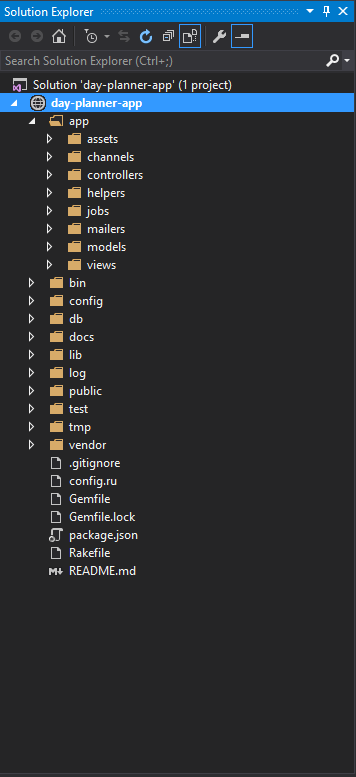

1.	The `app` directory is the main and most important directory contains __model, view__ and __controller__ of Day Planner App.

    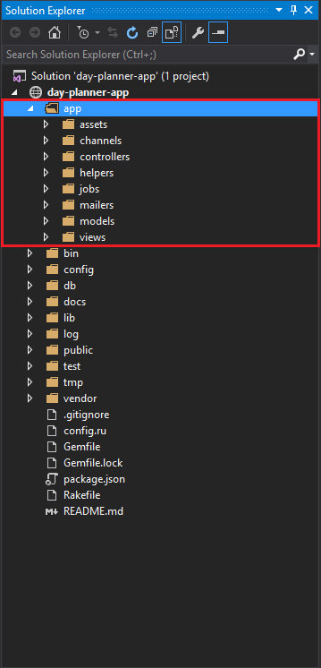

1.	The `assets` directory contains the images, javascripts and stylesheets which are exposed to client. 
    This directory contains some sub-directories, they are as follows:-  
    - __`images`__ :- Contains images used in our app.
    - __`javascripts`__ :- Contains all JavaScript files which make our app interactive.
    - __`stylesheets`__ :- Contains all css files.

    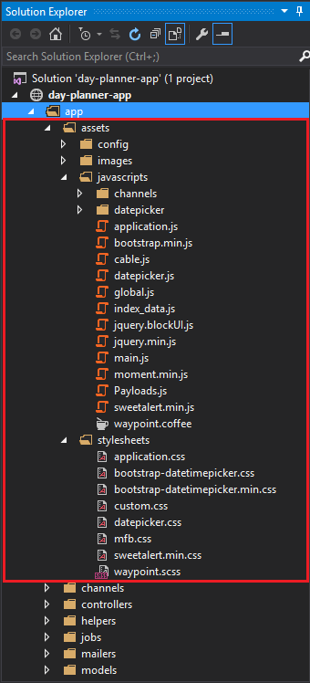

1.  The `controller` directory contains controllers used in this application, It handles a web request from the user. 
    The `waypoint_controller.rb` file contains:-
    - Interface to perform actions on __AzureDB for PostgreSQL__ 
    - Sample data creation on __PostgreSQL Database__ 
    - Interface to perform actions on __Azure Search Service__ 
    - Sample data creation on __Azure Search Service__ 

    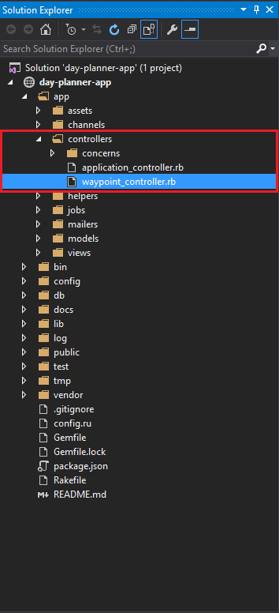

1.  The `helper` sub-directory holds any helper classes used to assist the model, view, and controller classes. This helps to keep the model, view, and controller code small, focused, and uncluttered.

    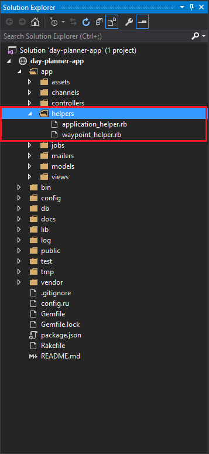

1.  The `views` sub-directory holds the display templates to fill in with data from our application, convert to HTML, and return to the user's browser.

    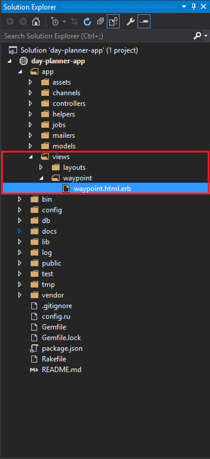

1.	The `config` directory contains `locales` sub-directory having `routes.rb` file which helps in routing to determine how an application responds to a client's request to a particular endpoint, which is an URI (or path) and a specific HTTP request method (GET, POST, and so on).

    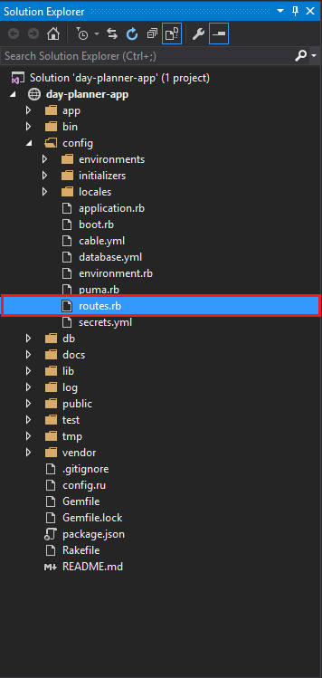

1.	The `config` directory contains `locales` sub-directory having `database.yml` file which includes **Azure Search Service API Key**, **Azure Search Service URL**, **Azure Search Service Index Name**, **Azure Search Service API Version** and **AzureDB for PostgreSQL Connection String**. 
    The values for many config file keys are being retrieved from the environment variables that has been set up using ARM template, in the deployed application environment on 'Azure App Service'. 
    If you require to make the changes in the Search API key, Search API Version and Postgres Connection string then this file will be helpful 
    
    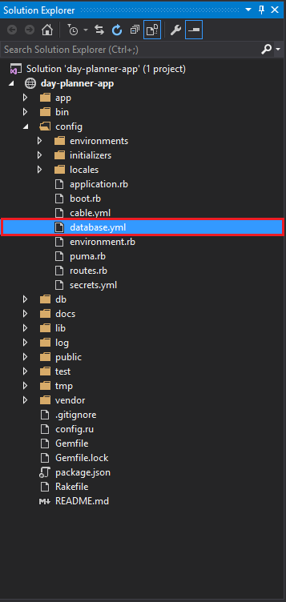

1.	The `db` directory, Rails application will have model objects that access relational database tables. You can manage the relational database with scripts you create and place in this directory.

    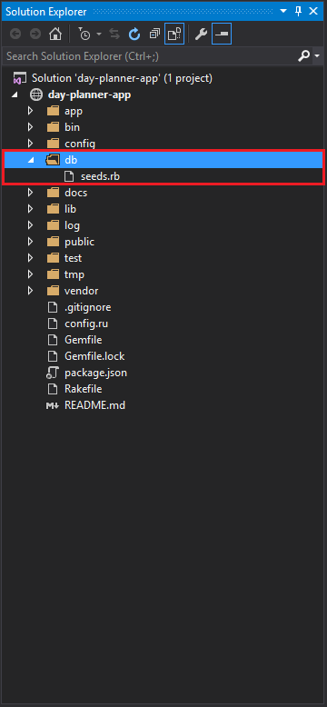

1.	The `Gemfile` is a list of all gems that you want to include in the project. It is used with bundler (also a gem) to install, update, remove and otherwise manage your used gems.

    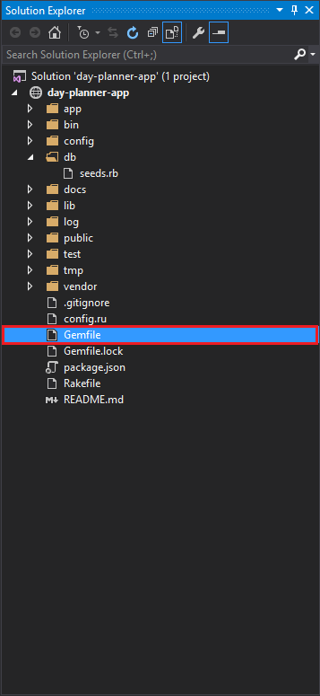

1.	The `docs` directory contains all the mark down (.md) files. These docs are helpful in understanding the app, integrated Azure services and the deployment strategy for the app.

    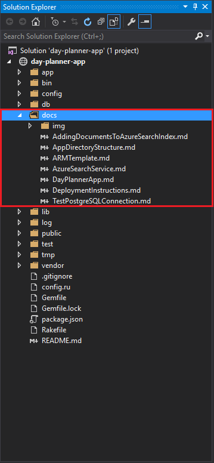

