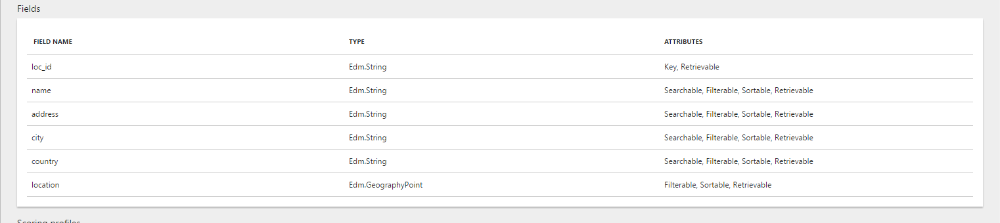

What is Azure Search?
========================

Azure Search is the Cloud based search as a service provided by Microsoft, which gives you the functionality to fill your point of interest data and then use it for search to your mobile and web application. Azure search provides you to manage this services using REST API or .NET SDK without handling its setup. 

Geosearch
========================

Azure Search logically processes, filters and respond the geographic location. It enables the user to get the Azure Search respond based on the requested data to the Azure search query string.

How it works with Day Planner App
========================

At the first launch of the application, the HTTParty PUT request will call using service url which create an index in Azure Search Service. Once index is created then after HTTParty POST request will call which feed some sample data of `Washington` region into ` azure-search-data` index through application. This PUT and POST request will call using Azure Search Service REST API.

When user use this application, he/she needs to select engagement from dropdown, select the range of the coffee shops in miles and click on search coffee shops button.

By this process, Azure Search service will execute the query given below.

` search=*&$filter=geo.distance(location, geography'POINT(Longitude Latitude)') le Radius`

In the above query, `location` is the field in the index having data type of `Edm.GeographyPoint` and its `Longitude` and `Latitude`.
`Radius` is the distance in `km` within which Azure Search Service will find out the coffee shops.

Here is some sample query. `search=*&$filter=geo.distance(location, geography'POINT(79.0453631 21.1535023)') le 5`

The about query will search the coffee shops less than `5 km` distance of the given latitude and longitude and give the response.

Search Service Index Schema
========================

Push coffee shops data into an index
========================

Here is the documentation to push coffee shops data manually into an index  <a href="AddingDocumentsToAzureSearchIndex.md">Push coffee shops data into an index</a>
