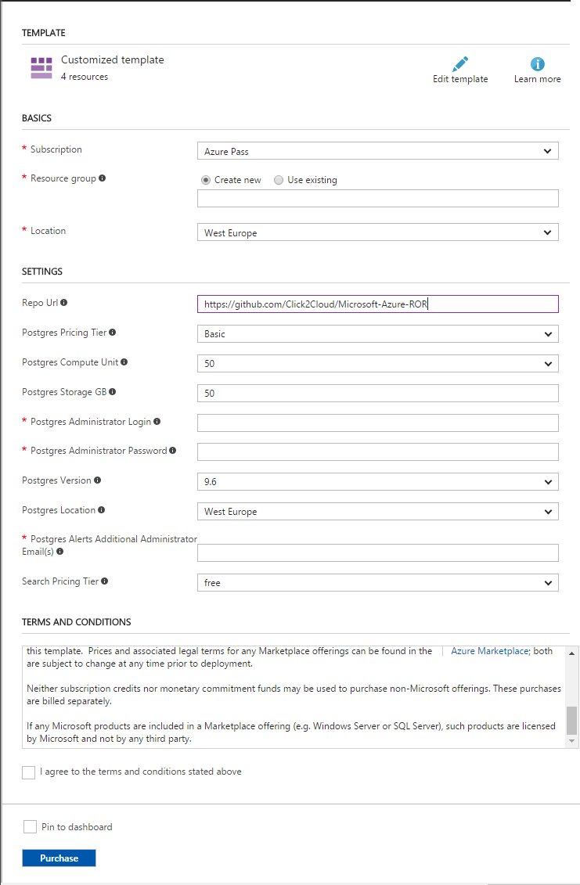

## Deployment Instructions

Perform following steps to Deploy Ruby on Rails web application in Azure and connect it to AzureDB for PostgreSQL Database Service and Azure Search Service.

1. Click on __Deploy to Azure__ button above. You will be redirected to custom deployment window of Azure Portal.
1. On __Custom deployment__ page, select __Subscription__ type.
1. Create new or use existing __Resource Group__. An Azure resource group is a logical container into which Azure resources like web apps, databases and storage accounts are deployed and managed. [Learn more here.](https://docs.microsoft.com/en-us/azure/azure-resource-manager/resource-group-portal)
1. Select __Location__ from the available locations for resource group.
1. The __Repo Url__ is the GitHub repository url of web application. The default value is set to the current GitHub repository url which contains sample Ruby on Rails application source code which connects with AzureDB for PostgreSQL Service and Azure Search service created with the ARM template. Leave as it is for this demo.

    

1. Select the __Postgres Pricing Tier__ or leave as it is.
1. Provide the __Postgres Compute Unit__ or leave as it is. [Learn more about Compute Unit](https://docs.microsoft.com/en-us/azure/postgresql/concepts-compute-unit-and-storage#what-are-compute-units)
1. The __Postgres Storage GB__ is the size of physical memory (in GB) for PostgreSQL Database Server. [Learn more about Storage Unit](https://docs.microsoft.com/en-us/azure/postgresql/concepts-compute-unit-and-storage#what-are-storage-units)
1. __Postgres Administrator Login__ is username for PostgreSQL Database Server.
1. __Postgres Administrator Login Password__ is password for PostgreSQL Database Server. It must contain character from three of the following categories – English uppercase letters, English lowercase letters, number (0-9) and non-alphanumeric characters (!, $, #, %).
1. Select __Postgres Version__ for PostgreSQL Database Server.
1. Select __Postgres Location__ from available locations for PostgreSQL Database Server.
1. Select __Search Service Tier__ from available plans.
1. Mark Check __I agree to the terms and conditions stated above__ checkbox. 
1. Click on __Purchase__ button.

It will take few minutes to deploy the Ruby on Rails application, AzureDB for PostgreSQL Service and Azure Search Service; and takes <b>3-5 mins at first time</b> to load the application. After successful deployment, you can browse the Day Planner App.
